# 🎓 University Management System
### *Okul Bilgilendirme ve Not Yönetim Sistemi*

[](https://nodejs.org/)
[](https://www.mongodb.com/)
[](https://reactjs.org/)
[](https://vitejs.dev/)

A premium, full-stack web application designed to digitize and streamline university academic processes. This system provides a seamless experience for **Students**, **Instructors**, and **Secretaries** through a modern, responsive interface.

---

## 📖 Table of Contents
- [✨ Key Features](#-key-features)
- [🛡️ Security & Configuration](#️-security--configuration)
- [🚀 Quick Start](#-quick-start)
- [👥 User Roles & Permissions](#-user-roles--permissions)
  - [🔐 Authentication](#-authentication)
  - [👨‍🎓 Student Module](#-student-module)
  - [👨‍🏫 Instructor Module](#-instructor-module)
  - [🏢 Secretary Module](#-secretary-module)
- [🛠️ Tech Stack](#️-tech-stack)

---

## ✨ Key Features
- **Role-Based Access Control (RBAC)**: Custom dashboards for different user types.
- **Smart Announcements**: Department-specific and university-wide broadcasting with type filtering (Normal, Final, Makeup).
- **Excel Grade Management**: Seamless bulk grade entry for instructors using automated Excel processing.
- **Exam Workflow**: Integrated lifecycle from secretary scheduling to instructor grading and student viewing.
- **Resit Exam Management**: Digital application and approval process for makeup/resit exams.
- **Responsive Design**: Optimized for both desktop and mobile viewing.

---

## 🛡️ Security & Configuration
Security is a top priority. Sensitive information is managed via environment variables and is never committed to version control.

- **`.env` Management**: All database URIs, JWT secrets, and API keys are stored in `.env` files.
- **Git Protection**: The project includes a comprehensive `.gitignore` file to prevent accidental exposure of secrets and temporary files (like `uploads/`).
- **Token-Based Auth**: Secure session management using JSON Web Tokens (JWT).

---

## 🚀 Quick Start

### 1. Prerequisites
- **Node.js**: v14+ 
- **MongoDB**: Local instance or Atlas cluster

### 2. Setup
Clone the repository and install dependencies in both the backend and frontend directories:

```bash
# Clone the repository
git clone <your-repo-url>
cd proje13

# Install Backend Dependencies
cd backend
npm install

# Install Frontend Dependencies
cd ../frontend
npm install
```

### 3. Environment Configuration
Copy the example environment files and fill in your credentials:

- **Backend**: Rename `backend/.env.example` to `backend/.env` and add your `MONGODB_URI`.
- **Frontend**: Rename `frontend/.env.example` to `frontend/.env` and adjust the `VITE_API_BASE_URL` if necessary.

### 4. Running the Application
```bash
# Start Backend (from /backend folder)
npm run dev

# Start Frontend (from /frontend folder)
npm run dev
```

---

## 👥 User Roles & Permissions

### 🔐 Authentication
The secure gateway to the system. The application detects your role and directs you to the appropriate dashboard instantly.

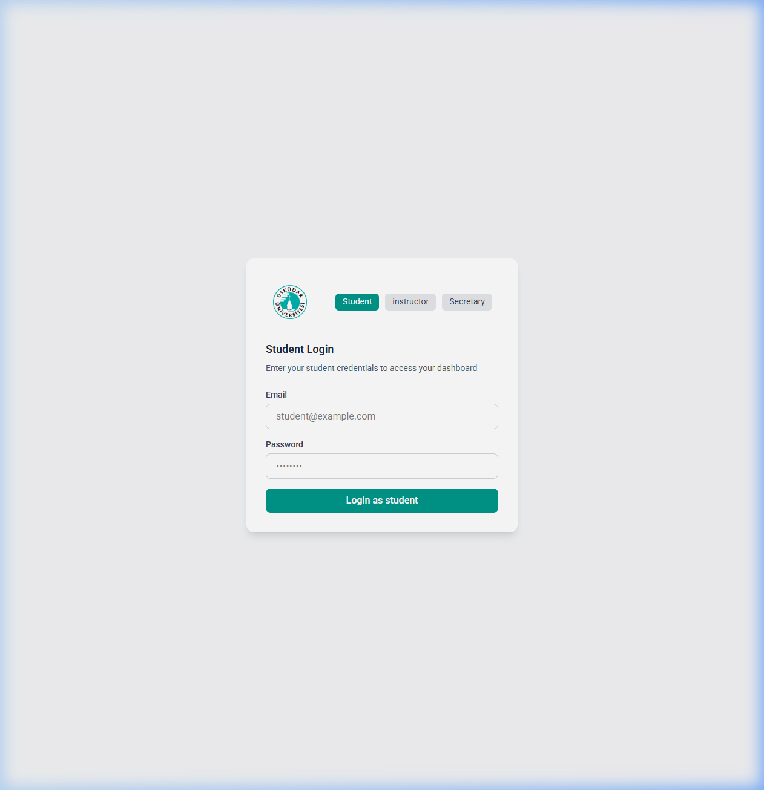
*Figure 1: Modern login interface with role-based redirection.*

---

### 👨‍🎓 Student Module
Designed to keep students informed and on track with their academic goals.

| Feature | Description |
| :--- | :--- |
| **Personal Dashboard** | View profile info and a live feed of university announcements. |
| **Grade Tracking** | Real-time access to course grades and performance metrics. |
| **Resit Requests** | Digital application portal for makeup exams if grades are below threshold. |

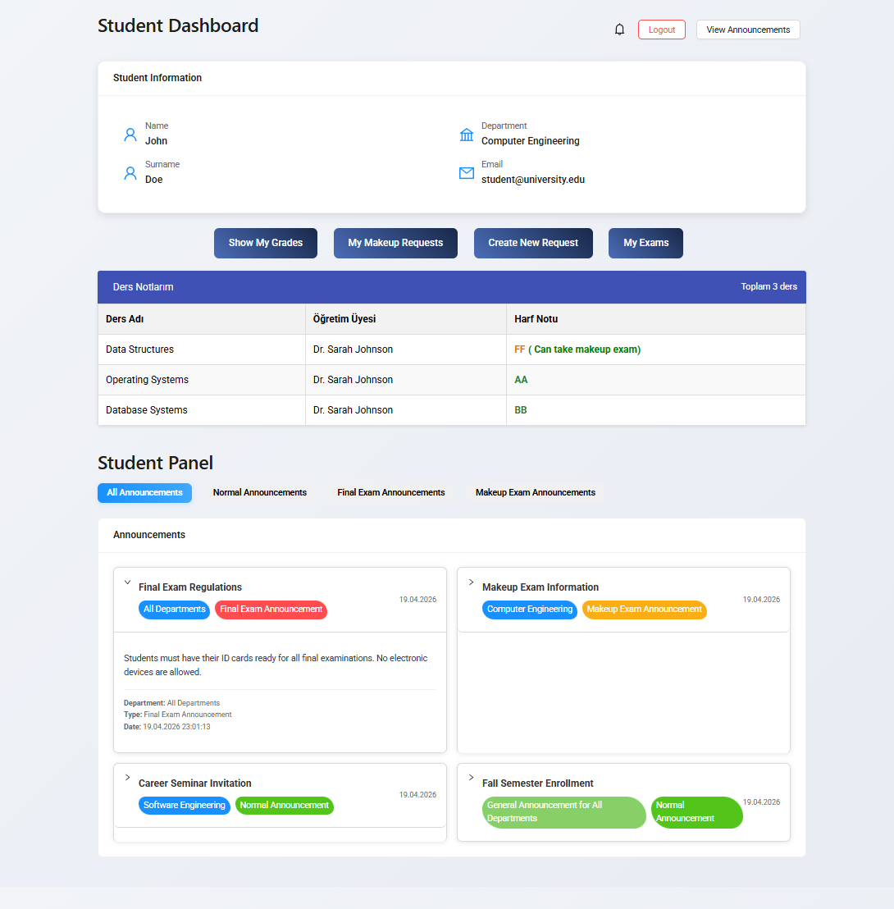
*Figure 2: Student Dashboard featuring targeted announcements.*

#### Resit Exam Management
Students can apply for makeup exams and track their approval status through a dedicated interface.

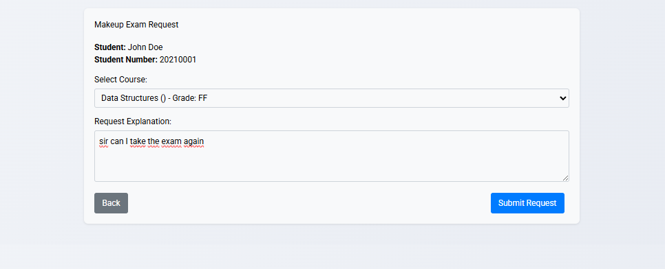
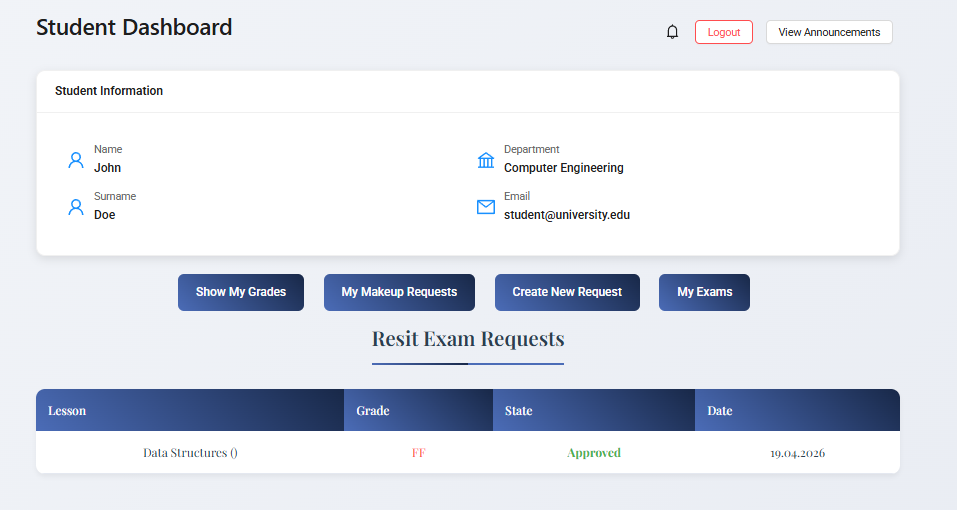
*Figure 3 & 4: The end-to-end makeup exam request and tracking process.*

---

### 👨‍🏫 Instructor Module
Empowering educators with efficient tools for course and grade management.

- **Bulk Grade Entry**: Download a template, fill it out, and upload. The system handles the rest.
- **Exam Lists**: Quick access to student lists and exam details for assigned courses.

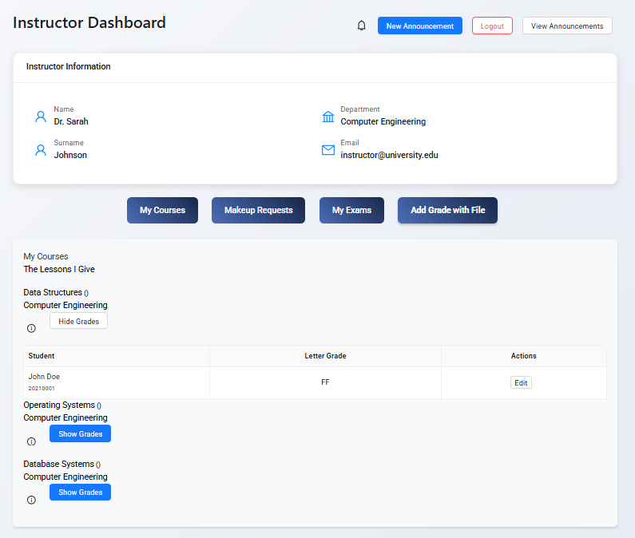
*Figure 5: Instructor central command center.*

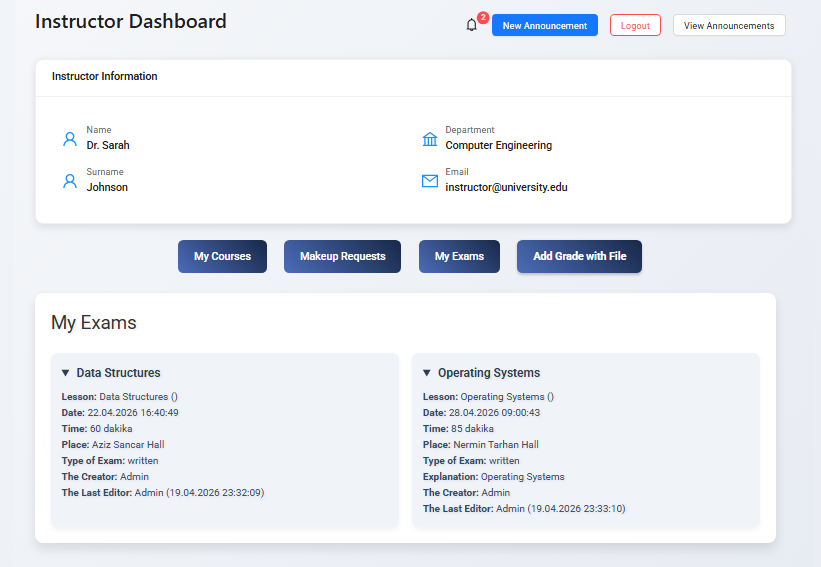
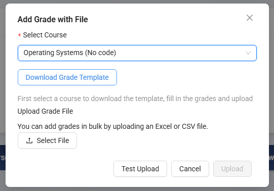
*Figure 6 & 7: Streamlined exam and grade management interfaces.*

---

### 🏢 Secretary Module
The administrative engine responsible for the institution's operational data.

- **Exam Scheduling**: Create and manage exam dates, locations, and rules.
- **Broadcast System**: Manage official announcements for specific departments or the entire campus.
- **Application Processing**: Review and approve student requests for makeup exams.

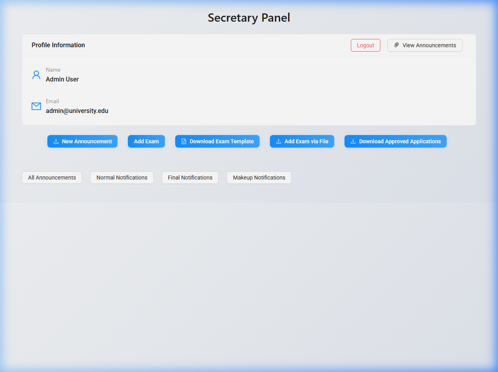
*Figure 8: Administrative overview panel.*

#### Administrative Workflows
Detailed tools for managing exams, templates, and student applications.

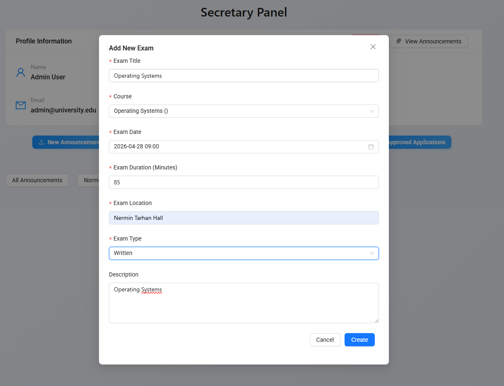
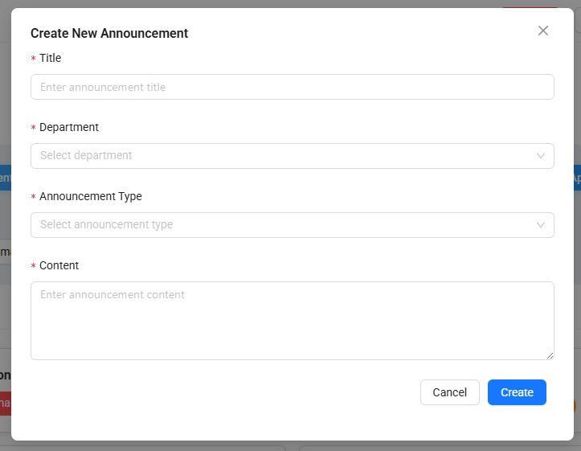
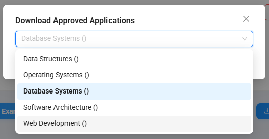
*Figure 9, 11, 12: Core administrative workflows for university staff.*

---

## 🛠️ Tech Stack
- **Frontend**: React.js, Vite, Axios, Lucide React (Icons)
- **Backend**: Node.js, Express.js
- **Database**: MongoDB (Mongoose ODM)
- **Utilities**: JWT (Auth), Bcrypt (Hashing), Multer (FileUploads), XLSX (Excel processing)

---
*Created with focus on efficiency, transparency, and modern academic standards.*
